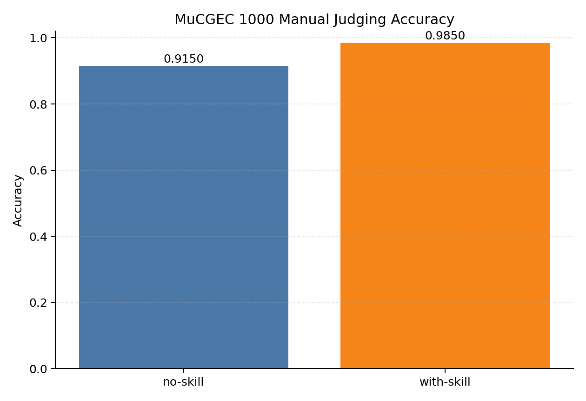
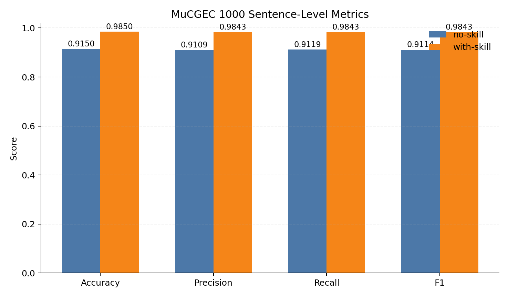
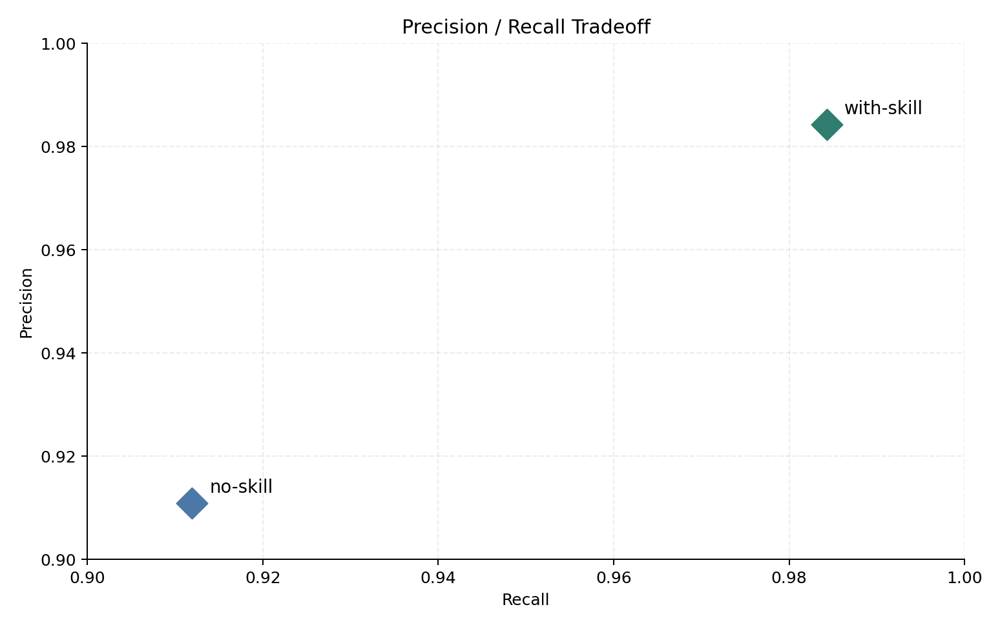
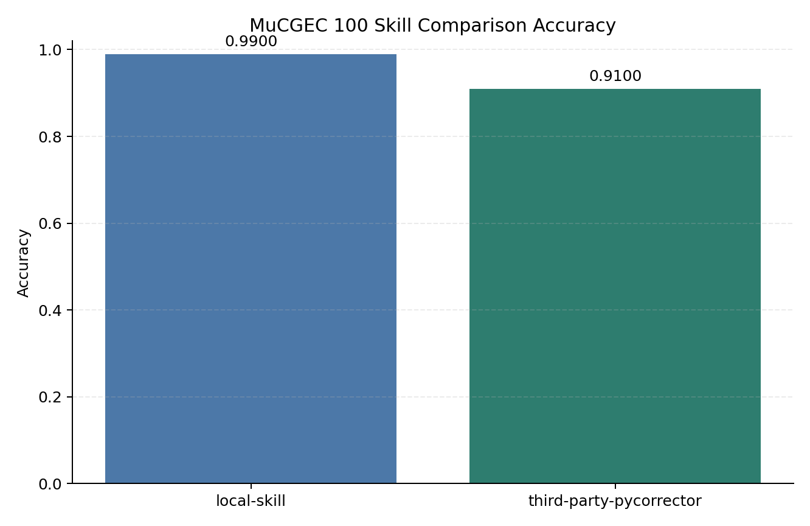
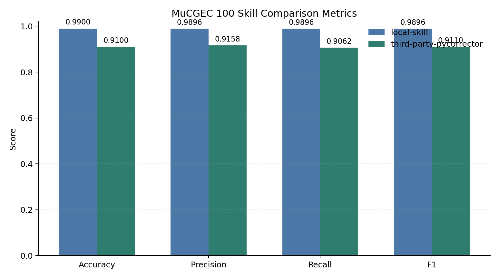
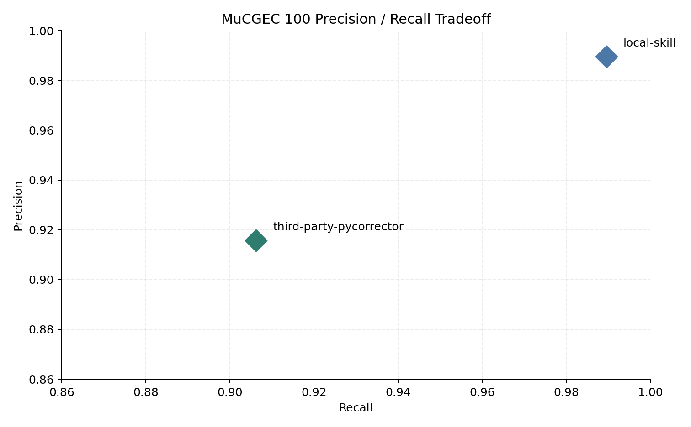
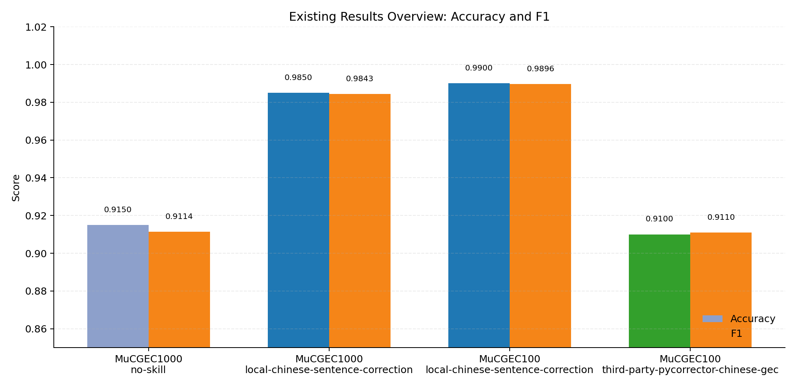
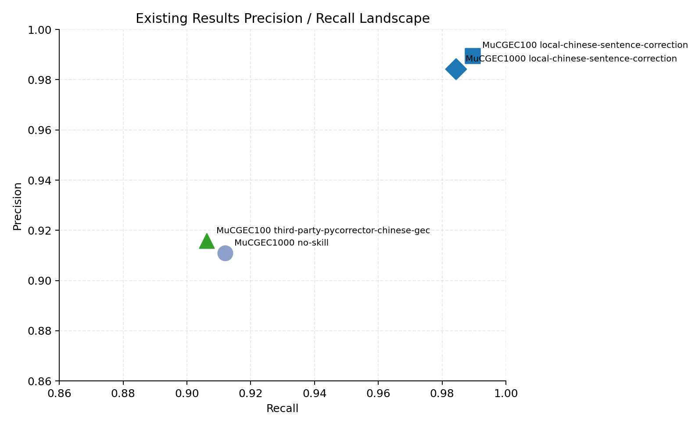

# 中文病句修改技能

[English](README.md) | [中文](README.zh-CN.md)

`chinese-sentence-correction` 是一个中文病句修改 skill，核心策略是“最小改动 + 保持原意”。

## 这个 skill 做什么

- 修改常见中文病句问题：用词、语法、语序、冗余、连贯性、指代清晰度。
- 采用四步法：读原意 -> 找病灶 -> 最小修改 -> 回读复核。
- 输出只保留修改后的句子。

## Skill 文件

- `SKILL.md`

## 实测结果（来自已完成实验）

本仓库中的结果全部来自已完成实验，不是估算值。

### A) `no-skill` vs `chinese-sentence-correction`（MuCGEC dev 随机 1000 题）

来源报告：`experiment/results/experiment_report_mucgec1000_skill_vs_noskill.md`

| 条件 | Accuracy | Precision | Recall | F1 | TP | FP | FN | TN |
|---|---:|---:|---:|---:|---:|---:|---:|---:|
| `no-skill` | 0.9150 | 0.9109 | 0.9119 | 0.9114 | 869 | 85 | 84 | 44 |
| `chinese-sentence-correction` | 0.9850 | 0.9843 | 0.9843 | 0.9843 | 939 | 15 | 15 | 45 |

- Accuracy 提升（`chinese-sentence-correction - no-skill`）：**+0.0700**

#### 图表

### B) `third-party-pycorrector-chinese-gec` vs `chinese-sentence-correction`（MuCGEC100）

来源报告：`experiment/results/experiment_report_mucgec100_skill_compare.md`

| 条件 | Accuracy | Precision | Recall | F1 | TP | FP | FN | TN |
|---|---:|---:|---:|---:|---:|---:|---:|---:|
| `third-party-pycorrector-chinese-gec` | 0.9100 | 0.9158 | 0.9062 | 0.9110 | 87 | 8 | 9 | 4 |
| `chinese-sentence-correction` | 0.9900 | 0.9896 | 0.9896 | 0.9896 | 95 | 1 | 1 | 4 |

- Accuracy 提升（`chinese-sentence-correction - third-party-pycorrector-chinese-gec`）：**+0.0800**

#### 图表

## 可比性说明

- `no-skill` 对比实验和 `pycorrector` 对比实验来自不同规模（1000 vs 100）的已完成实验。
- 因此两者都是真实实测，但 `no-skill` 与 `third-party-pycorrector-chinese-gec` 之间应视为间接参照，而非同场严格对决。

### 现有结果总览图

## 许可证

MIT，详见 `LICENSE`。
